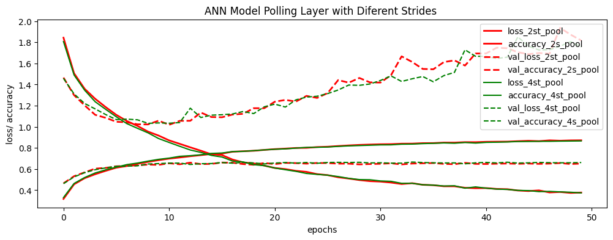
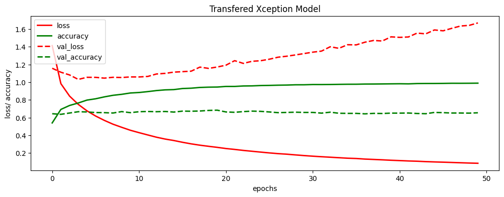

# 🧩 Deep Convolutional Neural Networks for CIFAR-10 Classification

This project explores building, training, and evaluating **Convolutional Neural Networks (CNNs)** on the **CIFAR-10** dataset with comparisons against Dense models, learning rate schedules, pooling strategies, stride effects, and Transfer Learning using **Xception**.

---

## 🎯 Project Goals

- Develop a custom CNN for CIFAR-10 image classification.
- Compare CNN performance with a pre-trained Dense (fully connected) model.
- Assess the impact of learning rate schedules: **ExponentialDecay** vs **OneCycle**.
- Examine the role of Pooling layers and different stride values on training efficiency and accuracy.
- Apply **Transfer Learning** using **Xception** and evaluate fine-tuning benefits.

---

## ⚙️ Technologies Used

- **Language:** Python
- **Libraries:** TensorFlow, Keras, NumPy, Matplotlib, Scikit-learn
- **Environment:** Google Colab

---

## 📅 Dataset

- **Source:** CIFAR-10 (10 classes, 60,0CIFAR-10 (10 classes, 60,000 imag00 images)
- **Test_size:**  15% of images
- **Train_size:**  85% of images
- **Image Size:** 32x32x3 (RGB)
- **Preprocessing:** Normalized to pixel values between 0 and 1

---

## 🏗️ Experiments & Results

### 1️⃣ CNN vs. Dense Model Comparison (with Overfitting Discussion)

| Model       | Train Accuracy | Test Accuracy | Training Time (50 epochs) |
|------------|----------------|---------------|---------------------------|
| **CNN**    | 96.18%         | 65.38%        | 11,768 sec                |
| **Dense**  | 59.47%         | 50.04%        | Pre-trained model used    |

✅ The **CNN** model shows significantly better accuracy than the Dense model on both train and test sets.  
❗ However, **overfitting is evident in CNN** (train accuracy far exceeds test accuracy).  
*(Note: The Dense model was pre-trained, saved, and only re-evaluated here without retraining.)*

---

### 🔍 Why Overfitting Occurs (in most models in this project):
- The dataset (CIFAR-10) is relatively small for the complexity of deep CNNs and Xception.
- No **Data Augmentation** was applied.
- Training was conducted for a fixed **50 epochs** across all models without **EarlyStopping**.
- Limited **Dropout** and **Regularization** were used.

**We deliberately avoided EarlyStopping and other overfitting reduction techniques to ensure a fair comparison across models under identical conditions (e.g., fixed epoch count of 50).**

---

### 🚀 How to Reduce Overfitting (Future Improvements):
- Apply **Data Augmentation** (flipping, cropping, rotations).
- Increase **Dropout** rate or add **L2 regularization**.
- Use **EarlyStopping** based on validation loss.
- Reduce model complexity or limit the number of epochs.

---

### 2️⃣ Learning Rate Schedules Comparison

| Schedule      | Train Accuracy | Test Accuracy | Training Time |
|--------------|----------------|---------------|---------------|
| Exponential  | 64.97%         | 52.57%        | 9902 sec      |
| OneCycle     | 94.31%         | 65.38%        | 10,000 sec    |

✅ The **OneCycle** schedule achieved higher accuracy despite slightly longer training time.

---

### 3️⃣ Pooling Layer vs. No Pooling

| Configuration  | Train Accuracy | Test Accuracy | Training Time |
|---------------|----------------|---------------|---------------|
| Without Pooling (23 epochs) | 92.47% | 58.97% | Very long (Colab crashed) |
| With Pooling (Stride 4)     | 95.18% | 66.07% | 6667 sec      |

✅ Pooling (Stride=4) drastically reduced training time while maintaining strong accuracy.  
🚫 Training without pooling led to excessively long sessions and overfitting without practical improvement.

---

### 4️⃣ Stride Impact on Pooling Efficiency

| Stride | Training Time (50 epochs) | Test Accuracy |
|--------|---------------------------|---------------|
| Stride 2 | ~11,768 sec | 65.38% |
| Stride 4 | 6667.80 sec | 66.72% |

✅ Increasing stride from 2 to 4 nearly halved training time with almost identical accuracy.  
👉 Loss and Accuracy curves below:

---

### 5️⃣ Transfer Learning with Xception

| Configuration             | Train Accuracy | Test Accuracy | Test Loss |
|---------------------------|----------------|---------------|-----------|
| All Layers Frozen         | N/A            | 0%            | 8.20      |
| Last Layer Trainable      | 98.56%         | 62.03%        | 1.99      |

✅ Without fine-tuning, the pre-trained model failed completely.  
✅ Training just the last layer boosted accuracy significantly—though the gap between train and test suggests **overfitting**.  
👉 Visualized Loss Curve:

---

## 📈 Key Takeaways:

- **CNNs outperform Dense models** but show clear overfitting.
- **OneCycle learning rate** improves generalization over ExponentialDecay.
- **Pooling with larger strides** greatly reduces training time without hurting accuracy.
- **Transfer Learning with fine-tuning** works effectively but needs regularization to prevent overfitting.

---

## 🚀 How to Run:

1. Download the `.ipynb` notebook and open in Google Colab or Jupyter.
2. Install dependencies:
 or use this command:
 pip install -r requirements.txt

3. Run all cells to reproduce results.

---

## 👩‍💻 Author:

**Souzaneh Sehati**  
GitHub: [souzaneh](https://github.com/souzaneh)

---

## ⚠️ Notes:

- GPU highly recommended.
- Overfitting mitigation was not applied here to maintain fair comparison across models under identical epoch settings.
